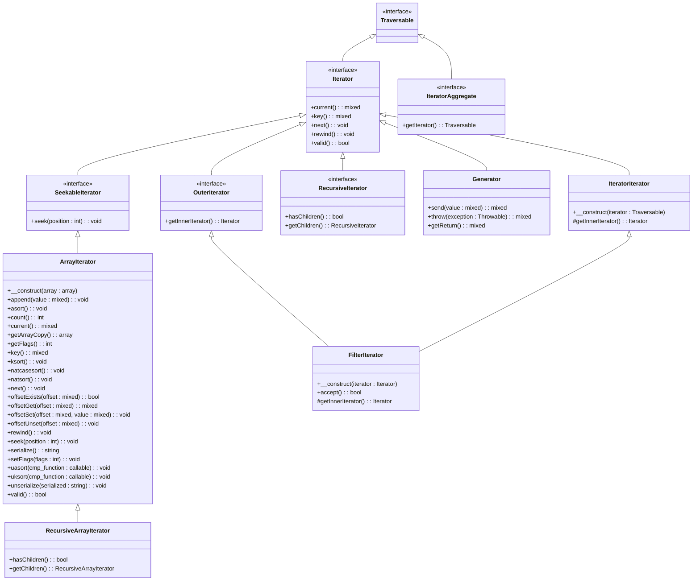

---
# You can also start simply with 'default'
theme: seriph
# random image from a curated Unsplash collection by Anthony
# like them? see https://unsplash.com/collections/94734566/slidev
background: https://cover.sli.dev
# some information about your slides (markdown enabled)
title: 時間の許す限りyieldの挙動を説明する
info: |
  PHPerKaigi 2025
  https://phperkaigi.jp/2025/
# apply unocss classes to the current slide
class: text-center
# https://sli.dev/features/drawing
drawings:
  persist: false
# slide transition: https://sli.dev/guide/animations.html#slide-transitions
transition: slide-left
# enable MDC Syntax: https://sli.dev/features/mdc
mdc: true
addons:
  - '@katzumi/slidev-addon-qrcode'
  - slidev-addon-components
  - slidev-addon-rabbit
---

# 時間の許す限りyieldの挙動を説明する

PHPerKaigi 2025 Mar 23, 2025.  
v0.0.2  
@katzumi(かつみ)

<div class="pt-12">
  <span @click="$slidev.nav.next" class="px-2 py-1 rounded cursor-pointer" hover="bg-white bg-opacity-10">
    Press Space for next page <carbon:arrow-right class="inline"/>
  </span>
</div>

<div class="abs-br m-6 flex gap-2">
  <button @click="$slidev.nav.openInEditor()" title="Open in Editor" class="text-xl slidev-icon-btn opacity-50 !border-none !hover:text-white">
    <carbon:edit />
  </button>
  <a href="https://github.com/k2tzumi/yield-deep-dive" target="_blank" alt="GitHub" title="Open in GitHub"
    class="text-xl slidev-icon-btn opacity-50 !border-none !hover:text-white">
    <carbon-logo-github />
  </a>
</div>

<!--
The last comment block of each slide will be treated as slide notes. It will be visible and editable in Presenter Mode along with the slide. [Read more in the docs](https://sli.dev/guide/syntax.html#notes)
-->

---
transition: fade-out
layout: two-cols-header
---

# 自己紹介

katzumi（かつみ）と申します。

「障害のない社会をつくる」をビジョンに掲げている「LITALICO」という会社に所属しています
<a href="https://litalico.co.jp/">

</a>

以下のアカウントで活動しています。

::left::

<div class="float-left">
  
<simple-icons-x /> <a href="https://twitter.com/katzchum">katzchum</a></div>  
<QRCode :width="180" :height="180" value="https://twitter.com/katzchum" color="4329B9" image="Logo_of_X.svg" />

::right::


<logos-github-octocat /> [k2tzumi](https://github.com/k2tzumi)  
<simple-icons-zenn /> [katzumi](https://zenn.dev/katzumi)  

<br />

<style>
h1 {
  background-color: #2B90B6;
  background-image: linear-gradient(45deg, #4EC5D4 10%, #146b8c 20%);
  background-size: 100%;
  -webkit-background-clip: text;
  -moz-background-clip: text;
  -webkit-text-fill-color: transparent;
  -moz-text-fill-color: transparent;
}
</style>

---
layout: two-cols-header
transition: fade-out
---


# お願い 🙏

写真撮影、SNS での実況について

登壇者の励みになるので是非ともご意見やご感想など、フィードバック頂けると助かります mm  
あとでスライドを公開します

::left::

<Transform :scale="2.5">
　　　🙆‍♀📷<ph-projector-screen-chart-light /><br />
　　　🙅‍♂📹💸<br />
　　　🙅📸👨‍👦‍👦<br />
</Transform>

::right::

<br />
<Transform :scale="2">
<fa6-brands-square-x-twitter />
</Transform>
<br />
<a href="https://x.com/search?q=%23phperkaigi%20%23a&f=live">#phperkaigi #a</a>


<!-- 本セッションでは、撮影やSNS拡散を歓迎しています。ご自由に写真を撮影して、XなどのSNSでシェアしてください。 　　
ただし、以下の点にご注意ください。　　

著作権などの法的な問題を避けるために、スライドや登壇者の写真や動画を無断で商用利用しないでください。　　
他の参加者のプライバシーや迷惑にならないように、撮影や投稿する際には配慮してください。　　
SNSでシェアする際には、ハッシュタグ「#phpcon_nagoya #s」をつけてください。　　
これにより、本セッションの関連情報を簡単に検索できるようになります。 -->

---
layout: default
transition: slide-up
---

# Yield is 何？🤔
一言で言うと...

「**データを一つずつ返す仕組み**」🔄

---

# ジェネレータ関数の特徴 ✨

- 関数の実行を一時停止できる 🛑
- メモリ効率が良い 💾
- イテレータを簡単に作れる 🔄
- 値を生成しながら処理できる 🏭

---

# 基本的な構文📝

```php {*|1-5|7-9|2,8|3,8|4,8}{lines:true}
function myGenerator() {
    yield 1;  // 一時停止して1を返す
    yield 2;  // 再開後、一時停止して2を返す
    yield 3;  // 再開後、一時停止して3を返す
}

foreach (myGenerator() as $value) {
    echo $value;  // 1, 2, 3 と出力
}
```

---

# 他の言語の類似機能🌎

- JavaScript: Generator functions
- Python: Generators
- C#: Iterator methods
- Ruby: Enumerators

---
layout: section
transition: fade-out
---

# yieldテスト始めるよ🎵

---
layout: statement
transition: fade-out
---

# 訓練されたPHPerなら余裕で答えられるよね？😎

---
layout: image-right
image: https://pbs.twimg.com/media/Gmof92JakAAnsla?format=jpg
backgroundSize: contain
transition: slide-up
---

# 提示するコードが正常終了するか？お考えください🌈
`assert` 関数が全て `true` になると思ったら、サイリウムを振ってください！🏁

<!--
refs: https://x.com/kotomin_m/status/1903368944800661992
-->

---
transition: fade
---

# テスト1️⃣ （持ち時間⏱️5秒）
変動する変数の値が返却されるよ！

```php {*|2,8|3,12|4,13|5,14|*}{lines:true}
<?php
$simpleGenerator = function(int $i) {
    yield $i++;     // 1回目の生成
    yield ++$i;     // 2回目の生成
    yield $i += 5;  // 3回目の生成
};
$actual = [];
foreach ($simpleGenerator(10) as $value) {
    $actual[] = $value;
}
$expected = [
    10, // 1 回目の期待値
    12, // 2 回目の期待値
    17  // 3 回目の期待値
];
assert($expected == $actual, var_export($actual, true));
```

[https://3v4l.org/TeZFJ](https://3v4l.org/TeZFJ)

---
layout: fact
transition: fade
---

# ✅️ Assert Success!

---
layout: center
transition: slide-up
---

# テスト1️⃣
インクリメントの挙動の確認でした！🔢

---
transition: fade
---

# テスト2️⃣ （持ち時間⏱️10秒）
値だけじゃなくてキーも返せるよ🗝️

```php {*|3,8-9,14|4,8-9,13|5,8-9,12|*}{lines:true}
<?php
$keyValueGenerator = function() {
    yield 3 => '参';    // 1回目の生成
    yield 2 => '弐';    // 2回目の生成
    yield 1 => '壱';    // 3回目の生成
};
$actual = [];
foreach ($keyValueGenerator() as $key => $value) {
    $actual[$key] = $value; // キーを指定して生成値を格納
}
$expected = [
    '壱',   // 3 回目の期待値
    '弐',   // 2 回目の期待値
    '参'    // 1 回目の期待値
];
assert($expected == $actual, var_export($actual, true));
```

[https://3v4l.org/VlB1K](https://3v4l.org/VlB1K)

---
layout: fact
transition: fade
---

# ❌️ Assert Fail!

```log {*|2-4}
Fatal error: Uncaught AssertionError: array (
  3 => '参',
  2 => '弐',
  1 => '壱',
) in php-wasm run script:12
Stack trace:
#0 php-wasm run script(12): assert(false, 'array (\n  3 => ...')
#1 {main}
  thrown in php-wasm run script on line 12
```


---
layout: center
transition: slide-up
---

# テスト2️⃣
ひっかけ問題すみません😅

リスト（キー指定していない `$expected`）の <span v-mark.circle.red="1">配列キーは 0 から始まる</span>よね。  
以下のコードなら Success ✅️  
並び順を揃えると厳密比較( `===` )させても OK🙆

```php {*|3-5|12-14|16}{lines:true}
<?php
$keyValueGenerator = function() {
    yield 2 => '参';    // 1回目の生成
    yield 1 => '弐';    // 2回目の生成
    yield 0 => '壱';    // 3回目の生成
};
$actual = [];
foreach ($keyValueGenerator() as $key => $value) {
    $actual[$key] = $value; // キーを指定して生成値を格納
}
$expected = [
    2 => '参',  // 1 回目の期待値
    1 => '弐',  // 2 回目の期待値
    0 => '壱'   // 3 回目の期待値
];
assert($expected === $actual, var_export($actual, true));
```

[https://3v4l.org/JEGt3](https://3v4l.org/JEGt3)


---
transition: fade
---

# テスト3️⃣ （持ち時間⏱️5秒）
テスト 1️⃣のケースでもキーをつけるとどうなるのかな？　🤨

```php {*|8-9|*}{lines:true}
<?php
$simpleGenerator = function(int $i) {
    yield $i++;     // 1回目の生成
    yield ++$i;     // 2回目の生成
    yield $i += 5;  // 3回目の生成
};
$actual = [];
foreach ($simpleGenerator(10) as $i => $value) {
    $actual[$i] = $value;   // キーを受け取り生成値を格納
}
$expected = [
    10, // 1 回目の期待値
    12, // 2 回目の期待値
    17  // 3 回目の期待値
];
assert($expected == $actual, var_export($actual, true));
```

[https://3v4l.org/5FkJX](https://3v4l.org/5FkJX)


---
layout: fact
transition: fade
---

# ✅️ Assert Success!
通常の list な array でも foreach でキーは使えますしね

---
layout: center
transition: slide-up
---

# テスト3️⃣

いい感じにキーを採番してくれます🔢


---
transition: fade
---

# テスト4️⃣ （持ち時間⏱️5秒）
キーあり、なしの組み合わせ行うとどうなるか？🔄

```php {*|3,5,6,10,12,13,17,18|4,7,11,14,17,18|*}{lines:true}
<?php
$keyValueGenerator = function() {
    yield 'one' => 1;   // 1: キー有り（文字列キー）
    yield 2;            // 2: キーなし
    yield 'three' => 3; // 3: キー有り（文字列キー）
    yield 4 => 'four';  // 4: キー有り（数値キー）
    yield 5;            // 5: キーなし
};
$expected = [
  'one' => 1,   // 1回目の期待値
  0 => 2,       // 2回目の期待値
  'three' => 3, // 3回目の期待値
  4 => 'four',  // 4回目の期待値
  5 => 5        // 5回目の期待値
];
$actual = [];
foreach ($keyValueGenerator() as $key => $value) {
    $actual[$key] = $value; // キーを受け取り生成値を格納
}
assert($expected == $actual, var_export($actual, true));
```

[https://3v4l.org/9k4Mi](https://3v4l.org/9k4Mi)

---
layout: fact
transition: fade
---

# ✅️ Assert Success!
失敗すると思ったでしょ？

---
layout: center
transition: slide-up
---

# テスト4️⃣
PHP の配列のキーって文字列と数値が混在させることが出来てアレ 🤯

キー指定がない場合、以下のルールで数値キーが自動採番させれます

- <span v-mark="{ at: 1, color: 'orange', type: 'underline', strokeWidth: 3 }">キー指定がない場合</span>、自動的に<span v-mark="{ at: 2, color: '#FCAF17', type: 'highlight', iterations: 3}">連番(0 から) が振られる</span> 📈  
`[ 'one' => 1]` の次が `[ 0 => 2 ]`  
`yield 2` のあとに `yield 2.5` を追加した場合は　`[ 1 => 2.5 ]`　が結果に追加となる
- 但し、<span v-mark="{ at: 3, color: 'yellow', type: 'highlight', strokeWidth: 2, multiline: true }">直前のキーが数値キーがだった場合は、そこからの連番</span>になる 🔄  
`[ 4 => 'four']` の次が `[ 5 => 5 ]`

---
transition: fade
---

# テスト5️⃣ （持ち時間 ⏱️5秒）
値を指定しない場合はどうなるのか？　🤔

```php {*|4,9,10|5,11,12|6,13,14|*}{lines:true}
<?php
function emptyYieldGenerator(int $case): iterable {
    switch ($case) {
      case 1: yield 'not empty'; break; // 値あり
      case 2: yield; break;             // 値なし
      default: return;                  // return
    }
}
$actual = iterator_to_array(emptyYieldGenerator(1));                // case1のイテレータを配列にコピーする
assert([ 0 => 'not empty' ] == $actual, var_export($actual, true)); // case1の期待値
$actual = iterator_to_array(emptyYieldGenerator(2));                // case2のイテレータを配列にコピーする
assert([] == $actual, var_export($actual, true));                   // case2の期待値
$actual = iterator_to_array(emptyYieldGenerator(3));                // case3のイテレータを配列にコピーする
assert([] == $actual, var_export($actual, true));                   // case3の期待値
```

[https://3v4l.org/AQPks](https://3v4l.org/AQPks)


---
layout: fact
transition: fade
---

# ❌️ Assert Fail!

```log {*|2}
Fatal error: Uncaught AssertionError: array (
  0 => NULL,
) in /in/AQPks:12
Stack trace:
#0 /in/AQPks(12): assert(false, 'array (\n  0 => ...')
#1 {main}
  thrown in /in/AQPks on line 12

Process exited with code 255.
```

---
layout: center
transition: slide-up
---

# テスト5️⃣
switch 文だと break しないと連続して yield されるので注意⚠️

2 回目の assert は　`[ 0 => null ]` になる
- <span v-mark="{ at: 1, color: 'orange', type: 'circle', strokeWidth: 3 }">`yield null` する場合と同義</span>💫  
null が返却される
- <span v-mark="{ at: 2, color: 'orange', type: 'underline', strokeWidth: 3 }">`return` はまた挙動が違う</span>  
要素自体が返却されない


---
layout: section
transition: fade-out
---

# ここまで余裕だよね？😎

---
layout: statement
transition: fade-out
---

# 少しだけ難易度上げるよ📈


---
transition: fade
---

# テスト6️⃣ （持ち時間 ⏱️10秒）
yield from という書き方もあります📦

```php {*|3,4,8,14|10,16|*}{lines:true}
<?php
function innerGenerator(): iterable {
    yield 'a' => 1; // 1: 通常
    yield 'b' => 2; // 2: 通常
}
function outerGenerator(): iterable {
    yield 'x' => 0;                   // 1: 通常
    yield from innerGenerator();      // 2: ジェネレータをまとめてyield
    yield 'y' => 3;                   // 3: 通常
    yield from ['c' => 4, 'd' => 5];  // 4: 配列をまとめてyield
}
$expected = [
    'x' => 0,             // outer1回目の期待値
    'a' => 1, 'b' => 2,   // outer2回目の期待値（innerの1,2回目）
    'y' => 3,             // outer3回目の期待値
    'c' => 4, 'd' => 5    // outer4回目の期待値（配列の1,2回目）
];
$actual = iterator_to_array(outerGenerator());  // outerGeneratorのイテレータを配列にコピーする
assert($expected === $actual, var_export($actual, true));
```

[https://3v4l.org/UKodH](https://3v4l.org/UKodH)


---
layout: fact
transition: fade
---

# ✅️ Assert Success!
今回は厳密比較でも OK です

---
layout: center
transition: slide-up
---

# テスト6️⃣
まとめて yield させることもできます📦

yield from キーワードを使ってジェネレータの委譲が出来ます。

<blockquote>
<p>外側のジェネレータは、内側のジェネレータ (あるいはオブジェクトや配列) から受け取れるすべての値を yield し、</p>
<p>何も取得できなくなったら外側のジェネレータの処理を続行します。</p>
</blockquote>


---
transition: fade
---

# テスト7️⃣ （持ち時間⏱️10秒）
yield from でキー指定ありなしを混在させるとどうなるか？🧩

```php {*|3,4,12,14,17,19|7,8,11,13,16,18|*}{lines:true}
<?php
function generatorWithKeys(): iterable {  // キーありジェネレータ
    yield "a" => 1;
    yield "b" => 2;
}
function generatorWithoutKeys(): iterable { // キーなしジェネレータ
    yield 3;
    yield 4;
}
function mixedGenerator(): iterable {
    yield from [5, 6];                  // 1: 配列（キーなし）からyield from
    yield from generatorWithKeys();     // 2: キーありジェネレータからyield from
    yield from generatorWithoutKeys();  // 3: キーなしジェネレータからyield from
    yield from ["c" => 7, "d" => 8];    // 4: 配列（キーあり）からyield from
}
$expected = [ 0 => 5, 1 => 6, // mixed1回目の期待値
  'a' => 1, 'b' => 2,         // mixed2回目の期待値
  2 => 3, 3 => 4,             // mixed3回目の期待値
  'c' => 7, 'd' => 8 ];       // mixed4回目の期待値
$actual = iterator_to_array(mixedGenerator());  // イテレータを配列にコピーする
assert($expected === $actual, var_export($actual, true));
```

[https://3v4l.org/1Sm6S](https://3v4l.org/1Sm6S)


---
layout: fact
transition: fade
---

# ❌️ Assert Fail!

```log {*|2-7}
Fatal error: Uncaught AssertionError: array (
  0 => 3,
  1 => 4,
  'a' => 1,
  'b' => 2,
  'c' => 7,
  'd' => 8,
) in /in/H0kbG:22
Stack trace:
#0 /in/H0kbG(22): assert(false, 'array (\n  0 => ...')
#1 {main}
  thrown in /in/H0kbG on line 22

Process exited with code 255.
```

---
layout: center
transition: slide-up
---

# テスト7️⃣ 
結果わかりづらいけれど。。 🤨

- キーの自動採番ルールはジェネレータ関数毎に適用される🔑  
mixedGenerator と generatorWithoutKeys の<span v-mark="{ at: 1, color: 'orange', type: 'circle', strokeWidth: 3 }">キーの採番は独立</span>する
- yield from で委譲した結果のキーは引き継がれる 🚀  
generatorWithoutKeys の結果が　`[ 2 => 3, 3 => 4]` ではなく `[ 0 => 3, 1 => 4]`
- <span v-mark="{ at: 2, color: 'orange', type: 'underline', strokeWidth: 3 }">ジェネレータではキーの重複は OK 👌</span>  
通常の array では定義出来ないけれど、以下が返却されている  
`[ 0 => 3, 1 => 4, 'a' => 1, 'b' => 2, 0 => 3, 1 => 4, 'c' => 7, 'd' => 8]`  
<span v-mark="{ at: 3, color: 'yellow', type: 'highlight', strokeWidth: 3 }">キーの 0 と 1 が重複</span>して出現している。  
結果として配列の要素が上書きされて、失敗した。


---
layout: section
transition: fade-out
---

# まだまだ中級だね🎯

---
layout: section
transition: fade-out
---

# 基本構文だけじゃきついかな？ｗｗｗ😉
Iterator インターフェースを覚えよう 📚

---

# イテレータとは？
一言で言うと...

「**コレクションを順番に処理するための仕組み**」🔄

---

# イテレータの特徴✨

- データを **一つずつ** 取り出せる 🔄
- 内部状態を保持している 📝
- `foreach` で簡単に使える 🔁
- コレクションの実装を隠蔽できる 🧩

---

# PHPのIteratorインターフェース 📜

```php {*}{lines:true}
interface Iterator extends Traversable {
    public function current();  // 現在の要素を返す
    public function key();      // 現在のキーを返す
    public function next();     // 次の要素に進む
    public function rewind();   // 最初に巻き戻す
    public function valid();    // 現在位置が有効か確認
}
```

---

# イテレータの実装例📝

```php {*}{lines:true}
// カスタムイテレータ
$it = new ArrayIterator([1, 2, 3]);

// foreachで使用
foreach ($it as $key => $value) {
    echo "$key: $value\n";
}

// 手動制御も可能
$it->rewind();
while ($it->valid()) {
    echo $it->current() . "\n";
    $it->next();
}
```

---
transition: slide-up
---

# Iteratorインターフェースと関連クラス図🗺️
Generator クラスは Iterator インターフェースを実装しています
<Transform :scale="0.8">

</Transform>


<!--

-->

---
transition: fade
---

# テスト8️⃣ （持ち時間⏱️10秒）
return を組み合わせて利用する🔀

```php {*|6,12|3-5,10|6,13|*}{lines:true}
<?php
$generatorWithReturn = function() {
    yield 1;                      // 1回目生成
    yield 2;                      // 2回目生成
    yield 3;                      // 3回目生成
    return ['a' => 4, 'b' => 5];  // 最後にreturn
};
$gen = $generatorWithReturn();      // ジェネレータ関数インスタンス化
$actual = iterator_to_array($gen);  // イテレータを配列にコピーする
$expected = [1, 2, 3];              // 1〜3回までの期待値
assert($expected === $actual, var_export($actual, true)); 
$actual = $gen->getReturn();        // Generator::getReturn ジェネレータの戻り値を取得する
$expected = [ 1, 2 , 3, 'a' => 4, 'b' => 5]; // return部分の期待値
assert($expected == $actual, var_export($actual, true));
```

[https://3v4l.org/LXSYD](https://3v4l.org/LXSYD)

---
layout: fact
transition: fade
---

# ❌️ Assert Fail!

```log {*|2,3}
Fatal error: Uncaught AssertionError: array (
  'a' => 4,
  'b' => 5,
) in /in/LXSYD:14
Stack trace:
#0 /in/LXSYD(14): assert(false, 'array (\n  'a' =...')
#1 {main}
  thrown in /in/LXSYD on line 14

Process exited with code 255.
```

---
layout: center
transition: slide-up
---

# テスト8️⃣
返り値と生成値は独立しています🏝️

- ジェネレータの返り値は foreach ループでは取得できない🙅  
<span v-mark="{ at: 1, color: 'orange', type: 'circle', strokeWidth: 3 }">return の返り値は無視</span>される
- 専用の<span v-mark="{ at: 2, color: 'orange', type: 'underline', strokeWidth: 3 }"> `getReturn()` メソッドを使う</span>必要がある🤟  
`['a' => 4, 'b' => 5]` が返り値として取得できる
- `getReturn()` を使うには、ジェネレータを<span v-mark="{ at: 2, color: 'yellow', type: 'highlight', strokeWidth: 3 }">完全に消費（全ての yield を処理）する必要</span>がある  
途中で break した場合は例外が発生する🛑

<div class="box-text-memo">
【実用的な使用例】<br />  
ジェネレータで大量のデータを処理し、最後に集計結果や処理状態を返す<br />
例外処理と組み合わせて、エラー情報や処理結果を返す
</div>


---
transition: fade
---

# テスト9️⃣ （持ち時間⏱️5秒）
ジェネレータ関数を連続で呼び出した場合🧵

```php {*|2-7|8-11|12-14|15-|*}{lines:true}
<?php
$i = 1; // カウンター初期化
$generator = function() use($i) { // カウンター参照
    yield $i++;
    yield $i++;
    yield $i++;
};
$gen = $generator();  // ジェネレータ関数インスタンス化
$actual = iterator_to_array($gen);  // 1: イテレータを配列にコピーする
assert([1, 2, 3] === $actual, var_export($actual, true)); // 最初の呼び出しの期待値
assert(1 === $i);     // カウンターの状態を確認
$gen = $generator();  // ジェネレータ関数を再生成
$actual = iterator_to_array($gen);  // 2: イテレータを配列にコピーする
assert([1, 2, 3] === $actual, var_export($actual, true)); // ２回目の呼び出しの期待値
$actual = iterator_to_array($gen);  // 3: 連続してジェネレータを呼び出し
assert([1, 2, 3] === $actual, var_export($actual, true)); // 3 回目の呼び出しの期待値
```

[https://3v4l.org/FADKd](https://3v4l.org/FADKd)

---
layout: fact
transition: fade
---

# ❌️ Assert Fail!

```log {*|1}
Fatal error: Uncaught Exception: Cannot traverse an already closed generator in /in/FADKd:15
Stack trace:
#0 /in/FADKd(15): iterator_to_array(Object(Generator))
#1 {main}
  thrown in /in/FADKd on line 15

Process exited with code 255.
```

---
layout: center
transition: slide-up
---

# テスト9️⃣
use は値渡し

- クロージャで `use($i)` としているため、<span v-mark="{ at: 1, color: 'orange', type: 'box', strokeWidth: 3 }">値渡し</span>でキャプチャされる📌
- クロージャ内で `$i++` を使っていても、<span v-mark="{ at: 1, color: 'orange', type: 'circle', strokeWidth: 3 }">外部の `$i` に影響しない</span>
- 各ジェネレータインスタンスは独自のコピーの `$i` を持つ🖨️
- 各インスタンス内での増分は、そのインスタンスにのみ影響する🔒
- 2 回目の assert 及びジェネレータ関数は再実行↩️。3 回目は連続での呼び出し📣
- <span v-mark="{ at: 2, color: 'yellow', type: 'highlight', strokeWidth: 3 }">関数オブジェクトを連続的に呼び出すとエラー</span>になる🚫  
`Cannot traverse an already closed generator`

---
layout: section
transition: fade-out
---

# ギブアップしてもいいのよ？😅

---
layout: section
transition: fade-out
---

# 一気に難易度あげちゃうよ⤴️

---
transition: fade
---

# テスト🔟 （持ち時間⏱️10秒）
テスト 9️⃣を参照渡しにするとどうなるか？🤔

```php {*|3|8-11|12-14|15-17|*}{lines:true}
<?php
$i = 1; // カウンター初期化
$generator = function() use(&$i) { // 参照渡しに変更
    yield $i++;
    yield $i++;
    yield $i++;
};
$gen = $generator();  // ジェネレータ関数インスタンス化
$actual = iterator_to_array($gen);  // 1: イテレータを配列にコピーする
assert([1, 2, 3] === $actual, var_export($actual, true)); // 最初の呼び出しの期待値
assert(4 === $i);     // カウンターの状態を確認
$gen = $generator();  // ジェネレータ関数を再生成
$actual = iterator_to_array($gen);  // 2: イテレータを配列にコピーする
assert([4, 5, 6] === $actual, var_export($actual, true)); // ２回目の呼び出しの期待値
$gen->rewind();                     // Generator::rewind 最初に巻き戻す
$actual = iterator_to_array($gen);  // 3: 連続してジェネレータを呼び出し
assert([7, 8, 9] === $actual, var_export($actual, true)); // 3 回目の呼び出しの期待値
```

[https://3v4l.org/hIJq1](https://3v4l.org/hIJq1)


---
layout: fact
transition: fade
---

# ❌️ Assert Fail!

```log {*|1}
Fatal error: Uncaught Exception: Cannot rewind a generator that was already run in /in/hIJq1:15
Stack trace:
#0 /in/hIJq1(15): Generator->rewind()
#1 {main}
  thrown in /in/hIJq1 on line 15

Process exited with code 255.
```

---
layout: center
transition: slide-up
---

# テスト🔟 
途中まで期待通りだったが。。🤷‍♂️

- use で参照渡しにすると 1 回目と 2 回目のループの結果が変わってくる（期待通り）🌟  
2 回目は別シーケンスとして動作する
- ジェネレータ関数に対して<span v-mark="{ at: 1, color: 'orange', type: 'circle', strokeWidth: 3 }">一度使用した後に `rewind()` は呼び出せない</span>🛑  
PHP のジェネレータ関数はシングルパス（一方通行）のイテレータとして実装されている  
[オフィシャルドキュメント](https://www.php.net/manual/ja/generator.rewind.php) で `イテレータを巻き戻す` となっているのが罠🪤  
Generator オブジェクトだったら問題ない！
- 正しい使い方としては、<span v-mark="{ at: 2, color: 'orange', type: 'underline', strokeWidth: 3 }">新しいジェネレータインスタンスを作成する必要</span>がある🆕

---
transition: fade
---

# テスト⑪ （持ち時間⏱️10秒）
foreach を使わずに手続き的に書いてみる🧮

```php {*|2,7,8|4,9-11|5,12-14|6,15-|*}{lines:true}
<?php
$i = 1; // カウンター初期化
$generator = function() use(&$i) {  // 参照渡し
    yield 'key1' => $i++; // 最初のyield
    yield 'key2' => $i++; // ２つ目のyield
};
$gen = $generator();  // イテレータ生成
assert($i === 1);     // カウンターは変動なし
$gen->rewind();       // 最初のyieldまで実行する
assert($i === 2);     // カウンターはインクリメントされる
assert($gen->current() === 1 && $gen->key() === 'key1' && $gen->valid()); // 最初のyieldの期待値
$gen->next();         // 次のyieldまで実行する
assert($i === 3);     // カウンターはインクリメントされる
assert($gen->current() === 2 && $gen->key() === 'key2' && $gen->valid()); // ２つのyieldの期待値
$gen->next();         // 次のyieldまで実行する
assert($i === 3);     // カウンターは変動せず
assert($gen->current() === NULL && $gen->key() === NULL && $gen->valid() === false);  // 最終の期待値
```

[https://3v4l.org/PVN1G](https://3v4l.org/PVN1G)

---
layout: fact
transition: fade
---

# ✅️ Assert Success!
Iterator インターフェイスの使い方がわかっていいね

---
layout: center
transition: slide-up
---

# テスト⑪
foreach の内部がどうやって動いているか、おわかり頂けただろうか？👀

- <span v-mark="{ at: 1, color: 'orange', type: 'box', strokeWidth: 3 }">`rewind()` は最初の yield まで</span>コードを実行する⏯️  
`rewind()` を呼び出さなくて直接　`current()` を呼び出しても問題なし
- 2 回目以降の `rewind()` は実際にジェネレーター関数をリセットしない ⚠️  
例外が発生する（前述の通り）🚫
- <span v-mark="{ at: 1, color: 'orange', type: 'box', strokeWidth: 3 }">`next()` を呼ぶたびに次の `yield` まで</span>進む ⏭️  
最後の `yield` の後に `next()` を呼ぶと `valid()` が `false` になる
- <span v-mark="{ at: 2, color: 'orange', type: 'underline', strokeWidth: 3 }">`current()` と `key()` は現在の要素</span>のものにアクセスできる🔍  
呼び出す前に既に生成自体は完了している

---

# テスト⑪
Iterator インターフェースを利用して for 文で書き直す！🗒️

```php {*|9-11}{lines:true}
<?php
$generator = function() {
    yield 'key1' => 1;
    yield 'key2' => 2;
    yield from ['key3' => 3, 'key4' => 4];
};
$gen = $generator();
$actual = [];
for ($gen->rewind(); $gen->valid(); $gen->next()) {
    $actual[$gen->key()] = $gen->current(); 
}
$expected = [
    'key1' => 1,
    'key2' => 2,
    'key3' => 3,
    'key4' => 4
];
assert($expected === $actual, var_export($actual, true));
```

[https://3v4l.org/6vco4](https://3v4l.org/6vco4)

---
layout: section
transition: fade-out
---

# おわりだよ 🏁

---
layout: section
transition: fade-out
---

# いや嘘だよ😜

---
transition: fade
---

# テスト⑫ （持ち時間⏱️10秒）
参照を返すジェネレータだと。。？📎

```php {*|2,11|3,4,17|5,6,13,14,18|7,8,13,14,19|*}{lines:true}
<?php
function &referenceValueGenerator(): iterable {   // 参照を返すジェネレータ
    list($key, $value) = ['key1', 1];             // keyとvalueをセット
    yield $key => $value;             // 1回目の生成
    list($key, $value) = [$key.'2', $value + 1];  // keyとvalueをセット
    yield $key => $value;             // ２回目の生成
    list($key, $value) = [$key.'3', $value + 2];  // keyとvalueをセット
    yield $key => $value;             // 3回目の生成
}
$actual = [];
foreach (referenceValueGenerator() as $key => &$value ) { // 値を参照で受け取り
    $actual[$key] = $value; // valueをkey指定で格納
    $value *= 10;           // valueを10倍
    $kye = "kee";           // keyを変更
}
$expected = [
    'key1' => 1,    // 1回目の期待値
    'kee2' => 11,   // 2回目の期待値
    'kee3' => 112   // 3回目の期待値
];
assert($expected === $actual, var_export($actual, true));
```

[https://3v4l.org/TAL1W](https://3v4l.org/TAL1W)

---
layout: fact
transition: fade
---

# ❌️ Assert Fail!

```log {*|2-4}
Fatal error: Uncaught AssertionError: array (
  'key1' => 1,
  'key12' => 11,
  'key123' => 112,
) in /in/TAL1W:21
Stack trace:
#0 /in/TAL1W(21): assert(false, 'array (\n  'key1...')
#1 {main}
  thrown in /in/TAL1W on line 21

Process exited with code 255.
```

---
layout: center
transition: slide-up
---

# テスト⑫
関数からリファレンスを返すのは PHP 標準機能！yield と組み合わせると強力💪

- 参照を返すジェネレータの定義方法📝  
<span v-mark="{ at: 1, color: 'orange', type: 'circle', strokeWidth: 3 }">関数名と値を参照する変数の前に `&` を付ける</span>
- 参照を返すジェネレータでも、キーは参照として扱われない制限がある⚠️  
 `&` を付けちゃうと `Key element cannot be a reference` と怒られる  
- 値を受け取る変数の上書きすると、<span v-mark="{ at: 2, color: 'orange', type: 'underline', strokeWidth: 3 }">ジェネレータ内の値も更新</span>される🔄  
10 倍してプラスするという挙動となる
- <span v-mark="{ at: 2, color: 'orange', type: 'underline', strokeWidth: 3 }">キー値は</span>値渡しになるので上書きしても<span v-mark="{ at: 2, color: 'orange', type: 'underline', strokeWidth: 3 }">変動しない</span>

---
transition: fade
---

# テスト⑬ （持ち時間⏱️10秒）
双方向通信をもっとスマートにやるには？📡

```php {*|6,16,17|2-6,15,20|6,9,16,20|6,8,17,20|6,8,18-20|*}{lines:true}
<?php
function communicatingGenerator(array $data = [1, 2, 3, 4]): Generator {
    $i = 0;
    $mode = null;
    do {
        $received = yield $data[$i];      // yieldの結果(send)を受け取り
        switch ($received ?? $mode) {
            case 'rev': $i--; $mode = 'rev'; break;               // 逆戻し
            case 'skip': $i += ($mode == 'rev' ? -2 : 2); break;  // スキップ
            default: $i++; $mode = 'fwd'; break;                  // 順送り
        }
    } while ($i < count($data) && $i >= 0);  // 配列インデックスの境界判定
}
$gen = communicatingGenerator();
$actual = [$gen->current(),   // 1回目生成
  $gen->send('skip'),         // 2回目生成
  $gen->send('rev')];         // 3回目生成
$gen->next();                 // 4回目生成
$actual[] = $gen->current();  // 4回目の結果取得
$expected = [1, 3, 2, 1];     // 1〜4回の生成の期待値
assert($expected === $actual, var_export($actual, true));
```

[https://3v4l.org/vcmul](https://3v4l.org/vcmul)

---
layout: fact
transition: fade
---

# ✅️ Assert Success!
Genarator::send()を利用して、順（逆）送りと skip を実現

---
layout: center
transition: slide-up
---

# テスト⑬
ジェネレータを単なるデータ生成以上の使い方ができる非常に強力な機能🔥

- 処理の動的な制御⚡️  
  - イテレーション中に<span v-mark="{ at: 1, color: 'orange', type: 'box', strokeWidth: 3 }">ジェネレータの動作をパラメータで調整</span>できる
  - 条件に基づいて異なるデータセットを生成可能
- ステートマシンの実装 ⚙️  
  - ジェネレータが状態を保持し、<span v-mark="{ at: 1, color: 'orange', type: 'box', strokeWidth: 3 }">外部からの入力に応じて状態遷移</span>できる
  - コールバックやオブザーバーパターンの代替として使える
- 遅延評価と動的計算 ⏳  
  - 計算の一部を遅延させ、<span v-mark="{ at: 1, color: 'orange', type: 'box', strokeWidth: 3 }">必要なときに外部からパラメータを与えられる</span>  
  - 複雑な計算を段階的に進められる

---
transition: fade
---

# テスト⑭ （持ち時間⏱️10秒）
例外も差し込めたりする🚨

```php {*|15|2-7,13,17|6,8-10,15,18|*}{lines:true}
<?php
function exceptionHandlingGenerator(array $data = [1, 2, 3]): Generator {
  $seek = 0;
  try {
    for ($seek = 0; $seek < count($data);) {
      $seek = yield $data[$seek];   // yield結果を受け取り
    }
  } catch (Exception $e) {
    return $data;   // 例外が発生した場合はretrun
  }
}
$gen = exceptionHandlingGenerator();
$actual = [$gen->current(), $gen->send(2)]; // 1回目、2回目(seekを2)
try {
  $gen->throw(new Exception()); // 例外をジェネレータにスローする
} catch (Throwable $e) {
  assert([1, 3] === $actual, var_export($actual, true));    // 生成値の期待値
  assert([1, 2, 3] == $gen->getReturn(), var_export($gen->getReturn(), true));  // 戻り値の期待値
}
```

[https://3v4l.org/hbWPu](https://3v4l.org/hbWPu)

---
layout: fact
transition: fade
---

# ✅️ Assert Success!
Genarator::throw()を利用して、例外処理もできる

---
layout: center
transition: slide-up
---

# テスト⑭
send と使い分け難しいかもだけれども😅

- `throw()` メソッドで<span v-mark="{ at: 1, color: 'orange', type: 'box', strokeWidth: 3 }">ジェネレータ内に例外を注入</span>します💉
- 注入された例外は、<span v-mark="{ at: 1, color: 'orange', type: 'box', strokeWidth: 3 }">ジェネレータ内の実行中のコンテキストで発生</span>します💥
- ジェネレータ内で<span v-mark="{ at: 1, color: 'orange', type: 'underline', strokeWidth: 3 }">例外をキャッチしない場合、例外は呼び出し元に伝播</span>します🌬️


---
layout: section
transition: fade-out
---

# ここまでできたなら 🏆

---
layout: section
transition: fade-out
---

# 合格🎓✨

---
layout: end
---

# Fin🎬